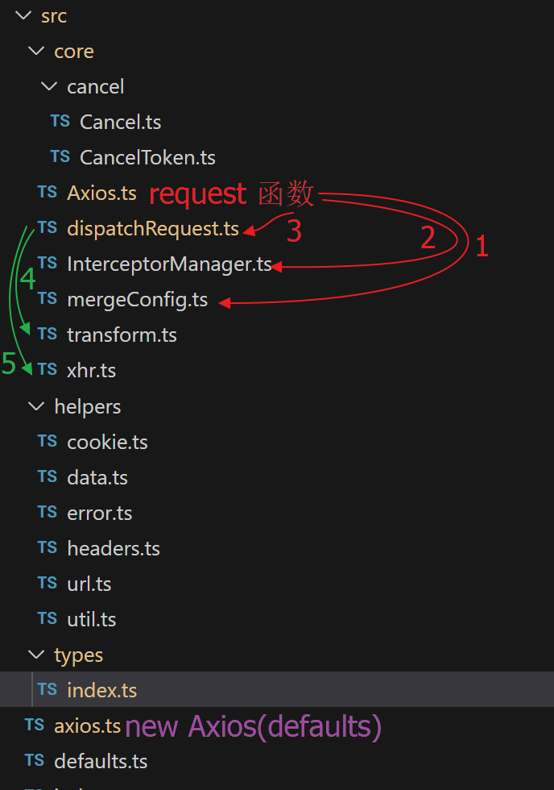

# 发起请求

- 底层使用 `XMLHttpRequest` 来发起请求

MDN 文档

- [使用 `XMLHttpRequest`](https://developer.mozilla.org/zh-CN/docs/Web/API/XMLHttpRequest/Using_XMLHttpRequest)
- [`XMLHttpRequest`](https://developer.mozilla.org/zh-CN/docs/Web/API/XMLHttpRequest)

# 处理请求相关逻辑

- 处理 `params` 并追加到 url 上：`buildURL` 函数
- 处理 `data`-自动序列化 `data` 对象为字符串：`send(data)` data 只能是 `Document` 或是 `XMLHttpRequestBodyInit` 对象，或是 null。`XMLHttpRequestBodyInit` 对象包括：（参考[MDN 文档](https://developer.mozilla.org/en-US/docs/Web/API/XMLHttpRequest/send#parameters)）
  - `Blob`
  - `ArrayBuffer`
  - `TypedArray`
  - `DataView`
  - `FormData`
  - `URLSearchParams`
  - 字符串字面量
  - **不能是对象（这里的对象是指狭义上的对象）**。因此 data 为对象时，需要 `JSON.stringify` 序列化为字符串
- 处理 `headers`：`data` 为对象时，默认加上请求头 `Content-Type: application/x-www-form-urlencoded;charset=UTF-8`，以便服务器能识别

# 处理响应相关逻辑

- `xhr` 函数返回一个 `Promise`，以便后续链式调用
- 构造返回：响应 + 请求，以便开发者后续处理
- 处理响应 `headers`： `parseHeaders` 函数，将字符串转为对象
- 如果响应返回的内容为字符串，尝试将字符串转为对象

# 错误处理

- 网络错误 `xhr.onerror`
- 超时 `xhr.ontimeout`
- 非 2xx/3xx 的请求
- 错误信息增强
  - 把 config、request、response 等追加到 AxiosError 对象中一并暴露给开发者

# 扩展接口

- `axios` 是一个混合对象：本身既是一个函数，又有其他属性
  - 实现：实现一个类（放置各个属性），然后将这个类的**原型属性**和自身属性再拷贝到一个函数上，所以用 `in`

```ts
export function extend<T, U>(to: T, from: U): T & U {
  for (const key in from) {
    ;(to as T & U)[key] = from[key] as any
  }
  return to as T & U
}

const context = new Axios()
const instance = Axios.prototype.request.bind(context)
extend(instance, context)
```

调用 `axios()` 实际上就是在调用 `axios.request()`

调用 `axios.get/post/...()` 等其实也是在调用 `axios.request()`

`axios.request` 中会去构造链式调用链，其中会去调用 `dispatchRequest` 函数

`dispatchRequest` 函数会去调用 `xhr` 函数

`xhr` 函数会去调用 `new XMLHttpRequest()`

- axios 函数重载
- 响应数据支持泛型

# 拦截器

对于 request 拦截器，后添加的拦截器会在请求前的过程中先执行（栈）

对于 response 拦截器，先添加的拦截器会在响应后先执行（队列）

关键代码

```ts
export default class Axios {
  interceptors: Interceptors

  constructor() {
    this.interceptors = {
      request: new InterceptorManager<AxiosRequestConfig>(),
      response: new InterceptorManager<AxiosResponse>()
    }
  }

  request(url: any, config?: any): AxiosPromise {
    if (typeof url === 'string') {
      if (!config) {
        config = {}
      }
      config.url = url
    } else {
      config = url
    }

    const chain: PromiseChain[] = [{
      // 拦截器支持异步函数。因此可以把发送请求的函数作为链式调用链中的其中一步
      resolved: dispatchRequest,
      rejected: undefined
    }]

    // 请求拦截器先注册的后调用，所以是压栈
    this.interceptors.request.forEach(interceptor => {
      chain.unshift(interceptor)
    })

    // 响应拦截器是先注册的先调用（队列）
    this.interceptors.response.forEach(interceptor => {
      chain.push(interceptor)
    })

    let promise = Promise.resolve(config)

    while (chain.length) {
      const { resolved, rejected } = chain.shift()!
      promise = promise.then(resolved, rejected)
    }

    return promise
  }

  // ...
}
```

拦截器对象的 `resolve`/`reject` 函数可以是同步函数，也可以是异步函数。无论哪种情况，都会被 `promise.then` 包裹成 `Promise` 对象，从而实现链式调用

## axios 的实现

> https://github.com/axios/axios/blob/v1.x/lib/core/Axios.js 看 `request` 函数的实现

1）axios 的拦截器数组是打平的，是一维数组，形如：`[resolve1, reject1, resolve2, reject2, resolve3, reject3, ...]`。**偶数下标为 `resolve`，奇数下标为 `reject`**
2）用一个变量 `i = 0`，记录当前遍历到的拦截器数组下标，每次都要同时取两个拦截器，分别对应 `resolve`、`reject`

```js
const l = chain.length
while (i < l) {
  promise = promise.then(chain[i++], chain[i++])
}
```

相比上面的实现，axios 实现的优点：

1）打平数组，不需要创建额外的空间来存放每个拦截器的 `resolve`、`reject`
2）用一个变量来记录遍历到的拦截器数组下标，而不是通过 `shift` 函数来获取，拦截器数组不存在变动，操作性能更优

# ts-axios 配置化实现

- 提供默认配置
- 合并默认配置、开发者传入的配置，如果是两者都是对象，需要考虑深合并
- `headers.common` 和 `headers[method]` 的合并需要额外处理：`flattenHeaders` 函数
- 请求和响应的配置化

```ts
export default function transform(
  data: any,
  headers: any,
  fns?: AxiosTransformer | AxiosTransformer[]
): any {
  if (!fns) {
    return data
  }
  if (!Array.isArray(fns)) {
    fns = [fns]
  }
  fns.forEach(fn => {
    data = fn(data, headers)
  })
  return data
}
```

使用 `transform` 函数

```js
// 请求
config.data = transform(config.data, config.headers, config.transformRequest)

// 响应
res.data = transform(res.data, res.headers, res.config.transformResponse)
```

- 原先对请求、响应的处理也挪到 transform 里
  - 请求
    - 规范请求头属性 `Content-Type` 命名
    - 如果 `data` 是对象（狭义），就默认给请求头加上 `Content-Type: 'application/json;charset=utf-8'`
    - 如果 `data` 是对象（狭义），就把 data 序列化为字符串（HTTP 不支持直接传输对象）
  - 响应：如果返回的数据是字符串，就**尝试**把字符串反序列化为对象


- 扩展 `axios.create` 静态接口

```ts
import mergeConfig from './core/mergeConfig'

function createInstance(config: AxiosRequestConfig): AxiosStatic {
  const context = new Axios(config)
  const instance = Axios.prototype.request.bind(context)

  extend(instance, context)

  return instance as AxiosStatic
}

const axios = createInstance(defaults)

// 核心代码
axios.create = function create(config) {
  return createInstance(mergeConfig(defaults, config))
}

export default axios
```

# 取消功能实现

> **一句话总结**：创建一个 `promise` 实例，通过 `then` 挂上异步执行逻辑，通过一个外部变量保存 `resolve` 函数，直到调用 `resolve` 函数后，`promise` 实例状态流转，异步逻辑才会被执行

其中一种调用方式

```js
const CancelToken = axios.CancelToken;
let cancel;

axios.get('/user/12345', {
  cancelToken: new CancelToken(function executor(c) {
    cancel = c;
  })
});

// 取消请求
cancel();
```

流程：

1. axios 提供一个 `CancelToken` 类
2. 开发者调用 `new CancelToken(c => cancel = c)` 创建一个实例，并通过 `cancelToken` 传入 axios。前面的实例化过程中会自动创建一个 pending 状态的 `promise` 实例，同时开发者能拿到该 `promise` 实例的 `resolve` 函数的引用 `c`
3. axios 判断 `cancelToken` 实例存在时，就链式调用 `cancelToken.promise.then()` 来注册 `xhr.abort()` 逻辑
4. 开发者调用 `cancel` 后，`promise` 实例状态变化 pending -> resolved，自动会去执行之前注册的 `xhr.abort()` 逻辑

以上功能的主要实现思路简化后如下：新建一个 `Promise` 实例，并通过 `then` 挂上要延迟执行的异步逻辑，记为 `x`。**先不 `resolve` 该实例**，用一个变量 `a` 保存 `resolve` 函数。直到调用 `a()` 后，逻辑 `x` 才会被执行，否则永远不会被执行

```js
let a

const p = new Promise((resolve, reject) => {
  a = resolve
})

p.then((payload) => {
  console.log('p.then payload=', payload)
})

console.log('开始')
setTimeout(() => {
  console.log('3 秒后')
  a('来自 3 秒后的 resolve')
}, 3000);
```

执行结果

```
开始
3 秒后
p.then payload= 来自 3 秒后的 resolve
```

另一种使用方式

```js
const CancelToken = axios.CancelToken;
const source = CancelToken.source();

axios.get('/user/12345', {
  cancelToken: source.token
}).catch(function (e) {
  if (axios.isCancel(e)) {
    console.log('Request canceled', e.message);
  } else {
    // 处理错误
  }
});

// 取消请求 (请求原因是可选的)
source.cancel('Operation canceled by the user.');
```

调用 `CancelToken.source()` 实际上就是在调用 `new CancelToken()`，得到的实例被记到了 `source.token` 上

- `isCancel` 函数的实现：需要对 `reason` 做改造

# withCredentials

允许跨域请求带上 cookie

# XSRF/CSRF 防御

每次发送请求的时候，从 cookie 中读取对应的 token 值，然后添加到请求 headers中

- 这个防御能起作用的原因（不会被伪造的原因）：
  - A 的代码发起的请求会走 A 的 axios 处理，也就是会有 CSRF 防御，请求头 headers 会带有 token 信息。
  - 用户 U 登录 A 后，再去访问 B，**B 想让用户 U 去访问 A，应该是只能通过构造完整的 A 路径如：https://a-site.com/path/to/a/page/ 让用户 U 去访问。这个请求会直接发起，不会走 A 的 axios 处理，因为不是 A 的代码发起的请求，请求头里也就不会有 token 信息**。

通过名字直接读取某个 cookie，以下也是 `axios` 的官方实现（https://github.com/axios/axios/blob/v1.x/lib/helpers/cookies.js）

```js
const cookie = {
  read(name: string): string | null {
    const match = document.cookie.match(new RegExp('(^|;\\s*)(' + name + ')=([^;]*)'))
    return match ? decodeURIComponent(match[3]) : null
  }
}
```

以下是来自 chatGPT 对以上正则的解释

> Q: 请详细解释 `new RegExp('(^|;\\s*)(' + name + ')=([^;]*)')`，特别需要说明下 `(^|;\\s*)` 是什么意思
>
> A: 在这段代码中，`new RegExp('(^|;\\s*)(' + name + ')=([^;]*)')` 是用于创建一个正则表达式对象。让我们逐步解释这个表达式的各个部分：
>
> 1. `^`：表示匹配字符串的开始位置。在这里，它用于匹配 cookie 字符串的起始位置。
>
> 2. `|`：表示逻辑 OR 运算符，用于在正则表达式中分隔两个不同的模式。
>
> 3. `;\\s*`：表示匹配一个分号 `;`，后面可以跟零个或多个空白字符（空格、制表符等）。`\s` 表示空白字符，`*` 表示匹配前面的模式零次或多次。
>
> 4. `(` + name + `)`：这是一个捕获组，用于匹配要读取的 cookie 的名称。`name` 是作为参数传递给 `read` 方法的字符串。
>
> 5. `=`：表示匹配一个等号，用于分隔 cookie 的名称和值。
>
> 6. `[^;]*`：表示匹配零个或多个非分号字符。`[^;]` 表示除了分号之外的任意字符，`*` 表示匹配前面的模式零次或多次。
>
> 综合起来，这个正则表达式的作用是在 cookie 字符串中搜索匹配指定名称的 cookie。它可以匹配以下两种情况之一：
> - 以指定名称开头（`^`），表示这是第一个 cookie。
> - 前面有一个分号和零个或多个空白字符（`;\\s*`），表示这是在其他 cookie 之后的一个 cookie。
>
> 这样，当调用 `cookie.read(name)` 方法时，会使用这个正则表达式来搜索匹配的 cookie，并返回其值。

即：`new RegExp('(^|;\\s*)(' + name + ')=([^;]*)')` 用于匹配两种情况，假设 name 为 `X-XSRF-TOKEN`

1. `X-XSRF-TOKEN=123456; ....` name 所在的 cookie 直接就在开头部分
2. `...; X-XSRF-TOKEN=123456; ....`，name 所在的 cookie 在中间或是最末尾的部分，因此前面会有 `; `，因此需要额外处理

要点：写正则时，不需要让正则表达式匹配目标文本的全部模式才能取到想要的内容，**让正则表达式只匹配部分内容的格式即可**

```js
const text = '！！33 hello world 世界之巅 ....;Lorem ang elit. ! \n\t[]po--==123))(((a=b; XSRF-TOKEN-D=1234abc; c=d; e=f'

const cookie = {
  read(name) {
    const match = text.match(new RegExp('(^|;\\s*)(' + name + ')=([^;]*)'))
      console.log('match ', match)
    return match ? decodeURIComponent(match[3]) : null
  }
}

// match [
//     "; XSRF-TOKEN-D=1234abc",
//     "; ",
//     "XSRF-TOKEN-D",
//     "1234abc"
// ]

cookie.read('XSRF-TOKEN-D') // 1234abc
```

# 上传、下载的进度监控

`xhr` 对象提供了一个 `progress` 事件，可以监听下载进度

`xhr.upload` 对象也提供了 `progress` 事件，可以监听上传进度

```js
if (onDownloadProgress) {
  request.onprogress = onDownloadProgress
}

if (onUploadProgress) {
  request.upload.onprogress = onUploadProgress
}
```

# Jest 做单元测试

- 使用了 `const handler = jest.fn(callback)` 去模拟了一个函数，利用 `handler` 来断言该函数是否被调用过，调用过多少次，调用时传了哪些参数
- 测试请求：伪造响应
- 异步测试

# 引用关系



# axios 的官方实现

对应本仓库的 `core/*`

https://github.com/axios/axios/blob/v1.x/lib/core/Axios.js
https://github.com/axios/axios/blob/v1.x/lib/core/dispatchRequest.js
https://github.com/axios/axios/blob/v1.x/lib/core/InterceptorManager.js
https://github.com/axios/axios/blob/v1.x/lib/core/mergeConfig.js
https://github.com/axios/axios/blob/v1.x/lib/core/transformData.js
https://github.com/axios/axios/blob/v1.x/lib/adapters/xhr.js 看默认导出函数

`src/axiosInstance.js` -> https://github.com/axios/axios/blob/v1.x/lib/axios.js

`src/defaults.js` -> https://github.com/axios/axios/blob/v1.x/lib/defaults/index.js

https://github.com/axios/axios/blob/v1.x/lib/helpers/buildURL.js
https://github.com/axios/axios/blob/v1.x/lib/helpers/combineURLs.js
https://github.com/axios/axios/blob/v1.x/lib/helpers/isURLSameOrigin.js
https://github.com/axios/axios/blob/v1.x/lib/helpers/isAbsoluteURL.js
